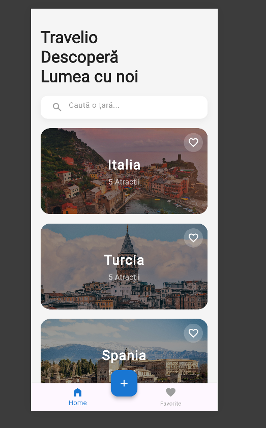
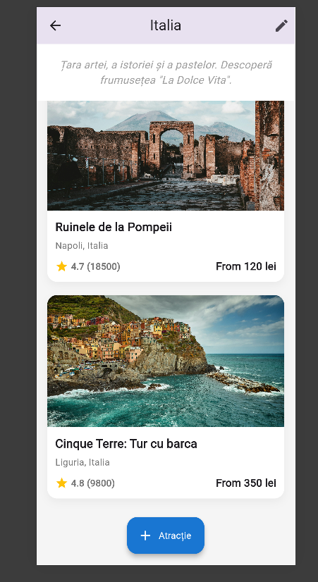
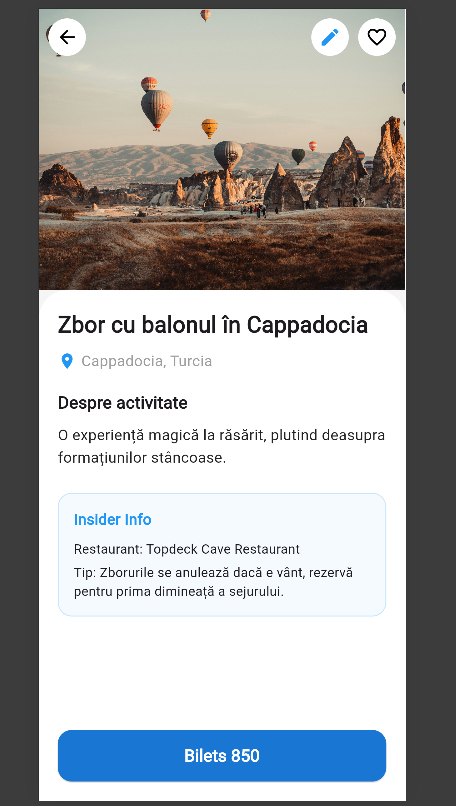

## ✈️ Travelio - Sistem Integrat de Management Turistic (Web Application)
📋 Cuprins
Viziunea Proiectului

Analiza Tehnică

Arhitectura Codului

Funcționalități Detaliate

Ghid de Instalare și Utilizare

Capturi de Ecran (Screenshots)

## 🌍 Viziunea Proiectului
Travelio nu este doar un simplu site de prezentare, ci un prototip de aplicație web modernă de tip Single Page Application (SPA) gândită să rezolve problema intermedierii dintre agențiile de turism și clienții finali. Proiectul pune accent pe conceptul de Mobile-First Design, asigurând o experiență de utilizare fluidă indiferent de hardware-ul utilizat.

## 🛠 Analiza Tehnică
Aplicația este construită folosind triada fundamentală a dezvoltării web (Frontend Stack):

HTML5 (HyperText Markup Language): Utilizat pentru structurarea semantică a datelor. Am folosit tag-uri precum <header>, <section>, <article> și <footer> pentru a îmbunătăți indexarea SEO și accesibilitatea.

CSS3 (Cascading Style Sheets): Responsabil pentru identitatea vizuală.

Flexbox & CSS Grid: Utilizate pentru alinierea dinamică a elementelor.

Media Queries: Implementate pentru a asigura adaptabilitatea pe rezoluții de la 320px la peste 1920px.

Custom Properties (CSS Variables): Pentru o mentenanță ușoară a paletei de culori și a tipografiei.

JavaScript (ES6+): Motorul de interactivitate al aplicației. Gestionează manipularea DOM-ului (Document Object Model), animațiile la scroll și procesarea datelor din formulare.

### 🏗 Arhitectura Codului
Proiectul este organizat modular pentru a respecta bunele practici în programare:

Header & Navigation: Implementează un meniu de tip "sticky" care oferă acces permanent la secțiunile principale. Pe mobil, meniul se transformă într-un format de tip "hamburger menu".

Hero Component: Zona de impact vizual care folosește imagini de înaltă rezoluție și overlay-uri de text pentru a capta atenția utilizatorului.

Service Section: Detaliază beneficiile utilizării platformei (ex: Ghiduri turistice, Prețuri avantajoase, Suport 24/7).

Booking Engine (Mock): O logică de interfață care simulează procesul de interogare a unei baze de date pentru disponibilitatea călătoriilor.

### ✨ Funcționalități Detaliate
🔍 Filtrare și Explorare
Utilizatorul poate parcurge o listă curată de pachete. Fiecare card de destinație include:

Indicator de preț dinamic.

Descriere succintă a obiectivelor turistice.

Buton de Call-to-Action (CTA) pentru rezervare rapidă.

### 📅 Sistem de Rezervare (UI/UX)
Formularul de rezervare include validări de bază pentru a preveni trimiterea datelor incomplete:

Câmpuri obligatorii (Nume, Email, Telefon).

Input-uri de tip dată (Check-in / Check-out).

Calcul vizual al numărului de persoane.

### 📱 Responsivitate (Responsive Design)
Site-ul a fost testat pe:

Desktop: Layout pe 3-4 coloane.

Tabletă: Layout pe 2 coloane.

Smartphone: Layout pe o singură coloană, optimizat pentru interacțiunea prin atingere (touch events).

## 📸 Interfața Aplicației

### 🏠 Ecran Principal (Home)

*Utilizatorul poate căuta destinații și poate vedea țările disponibile (Italia, Turcia, Spania).*

### 🏛️ Atracții per Destinație

*La selectarea unei țări, sunt afișate atracțiile locale cu prețuri, rating-uri și scurte descrieri.*

### 🎈 Detalii Activitate

*Pagina dedicată unei activități specifice (ex: Zbor cu balonul în Cappadocia) care include "Insider Info" și butonul de rezervare.*

🏠 Interfața Desktop (Home)
Imaginea prezintă secțiunea principală și bara de navigare transparentă.

📦 Secțiunea Pachete Turistice
Vizualizarea cardurilor de destinație cu efecte de hover (CSS transitions).

📱 Vizualizare Mobile
Demonstrația meniului adaptiv și a structurii verticale pe dispozitive mobile.
